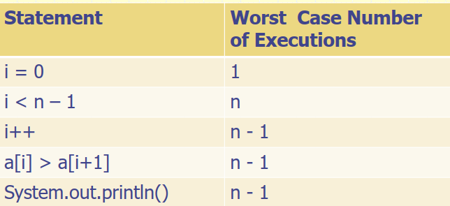

# 🚀 Key Git Commands Cheat Sheet

## 🔧 Setup

```bash
git config --global user.name "Your Name"
git config --global user.email "you@example.com"
```

## 📁 Repository Initialization

```bash
git init
git clone <repo-url>
```

## 🔍 Checking Status and Branches

```bash
git status
git branch
git branch -r // remote branches  # used most often
git branch -a // List all branches — both local and remote.
```

## 🔀 Switching and Creating Branches

```bash
git checkout <branch-name> # used most often
git switch <branch-name>
git checkout -b <new-branch> # used most often
git switch -c <new-branch>
```

## 💾 Staging and Committing

```bash
git add <file>
git add .
git commit -m "Your commit message"
```

## 🔼 Pushing to Remote

```bash
git push origin <branch-name>
git push -u origin <branch-name> # Set the upstream tracking relationship.
git branch -vv # Check relationship between remote & local

commit XXXXXXXXXXXX (HEAD -> local-branch, origin/remote-branch, origin/HEAD)
```



## 🔽 Pulling from Remote

```bash
git pull
git pull origin <branch-name>
```

## 🔁 Merging and Reverting

```bash
git merge <branch-name>
git revert <commit-id>
git reset --hard <commit-id>
```

## 🧼 Cleaning and Ignoring

```bash
git clean -fd
```

`.gitignore`  
_Add filenames or patterns to exclude from version control._

## 🗑 Undo Changes

```bash
git checkout -- <file>
git restore <file>
```

## 🧭 Logs and History

```bash
git log
git diff
git show <commit-id>
```

## ✅ Other Useful Commands

```bash
git remote -v
git fetch
git stash
git stash pop
```

## Go back

```bash
git log
# copy a commit hash, e.g. abc123

git checkout abc123          # go back and inspect
git reset --hard abc123      # go back and erase later commits
git revert abc123            # undo commit safely

```

## 📁 Scenario: Hide a folder from GitHub but keep it locally

### 🔹 Step 1: Remove folder from Git tracking (but not from disk)

```bash
git rm -r --cached folder_name/
```

- Removes the folder from the Git index (GitHub), but not your computer.

---

### 🔹 Step 2: Add folder to `.gitignore`

Edit or create the `.gitignore` file and add:

```
folder_name/
```

- Prevents Git from tracking this folder in the future.

---

### 🔹 Step 3: Commit and push changes

```bash
git add .gitignore
git commit -m "Remove and ignore folder_name"
git push
```

- Applies the removal and ignore rules to GitHub.

---

## 🔄 Example: Hiding a `secret_config/` folder

```bash
git rm -r --cached secret_config/
echo "secret_config/" >> .gitignore
git add .gitignore
git commit -m "Removed secret_config/ and added to .gitignore"
git push
```

---

## 📝 Useful Notes

| Command               | Purpose                                        |
| --------------------- | ---------------------------------------------- |
| `git rm --cached`     | Remove file/folder from index but keep locally |
| `.gitignore`          | List of files/folders Git should ignore        |
| `git add .gitignore`  | Track your ignore rules                        |
| `git commit -m "..."` | Save a commit message                          |
| `git push`            | Upload your changes to GitHub                  |

---

## ✅ Best Practices

- Always test `.gitignore` changes with `git status`.
- Never ignore files **after** pushing secrets – use GitHub's secret scanning.
- Use `git reset` or `git restore` carefully if you make a mistake.

---
