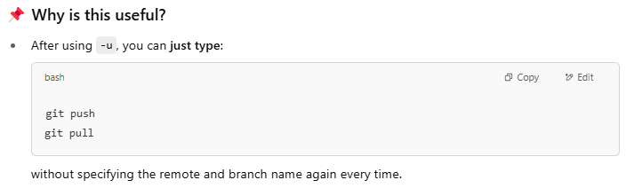

# 🚀 Key Git Commands Cheat Sheet

## 🔧 Setup

```bash
git config --global user.name "Your Name"
git config --global user.email "you@example.com"
```

## 📁 Repository Initialization

```bash
git init
git clone <repo-url>
```

## 🔍 Checking Status and Branches

```bash
git status
git branch
git branch -r // remote branches  # used most often
git branch -a // List all branches — both local and remote.
```

## 🔀 Switching and Creating Branches

```bash
git checkout <branch-name> # used most often
git switch <branch-name>
git checkout -b <new-branch> # used most often
git switch -c <new-branch>
```

## 💾 Staging and Committing

```bash
git add <file>
git add .
git commit -m "Your commit message"
```

## 🔼 Pushing to Remote

```bash
git push origin <branch-name>
git push -u origin <branch-name> # Set the upstream tracking relationship.
git branch -vv # Check relationship between remote & local
```



## 🔽 Pulling from Remote

```bash
git pull
git pull origin <branch-name>
```

## 🔁 Merging and Reverting

```bash
git merge <branch-name>
git revert <commit-id>
git reset --hard <commit-id>
```

## 🧼 Cleaning and Ignoring

```bash
git clean -fd
```

`.gitignore`  
_Add filenames or patterns to exclude from version control._

## 🗑 Undo Changes

```bash
git checkout -- <file>
git restore <file>
```

## 🧭 Logs and History

```bash
git log
git diff
git show <commit-id>
```

## ✅ Other Useful Commands

```bash
git remote -v
git fetch
git stash
git stash pop
```

## Go back

```bash
git log
# copy a commit hash, e.g. abc123

git checkout abc123          # go back and inspect
git reset --hard abc123      # go back and erase later commits
git revert abc123            # undo commit safely

```
